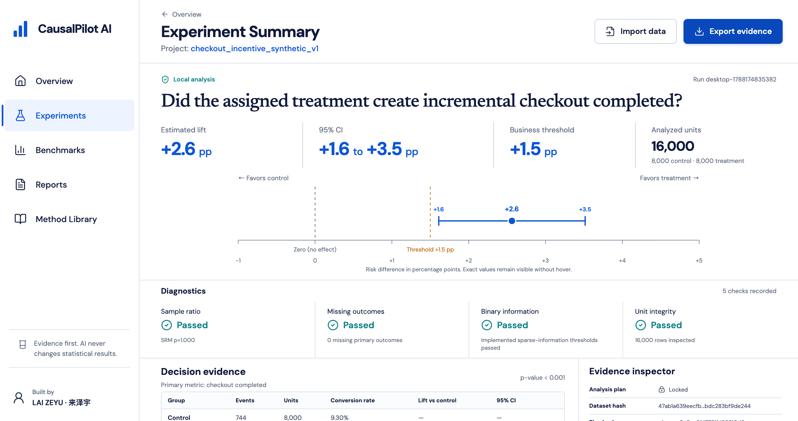

# CausalPilot AI

**Offline experiment analysis and evidence export for desktop**  
Product author and accountable owner: **LAI ZEYU (来泽宇)**

CausalPilot AI `0.1.0` is a working, offline-first desktop MVP for **declared randomized two-arm business experiments**. The packaged macOS workflow has been exercised end to end. A Windows x64 source, packaging, and CI candidate is also present, but it has not yet produced preserved Windows-runner, installation, signing, WACK, or Microsoft Store evidence. In the desktop workflow, a user can select a CSV, map the experiment fields, confirm the assignment design, run a deterministic local analysis, review effect size and uncertainty alongside quality diagnostics, and export an aggregate evidence bundle.

The packaged analysis path does **not** start an HTTP or localhost analysis service. Electron invokes a bundled Python sidecar directly with fixed process arguments and JSON over standard input/output. Raw experiment rows remain on the user's device during this workflow. There is no account, cloud sync, telemetry integration, external AI call, or runtime language model in version `0.1.0`.



> **Release boundary:** an Apple-silicon DMG was built, hashed, mounted read-only, and exercised end to end on the build Mac. Its ad-hoc bundle signature passes strict on-disk verification, but it is **not** Apple Developer ID signed or notarized, Gatekeeper assessment rejects it, and no clean-device installation or public availability claim has been established. See [`evidence/releases/0.1.0/release-summary.md`](evidence/releases/0.1.0/release-summary.md).

> **Windows boundary:** Windows x64 build scripts, an unpacked-app test path, four packaged-screenshot checks, and a GitHub Actions draft-release workflow are defined. They are release infrastructure, not proof of a successful Windows build. No Windows artifact hash or compatibility claim is valid until the workflow runs and its result is reviewed on Windows. Microsoft Store submission remains a separate gate.

## What the working MVP does

1. Opens a native desktop file chooser for a UTF-8 CSV up to 100 MB.
2. Returns an opaque, short-lived file capability and column names to the renderer; it does not expose the absolute path or Node.js APIs.
3. Lets the user map unit ID, treatment, and outcome fields. A covariate can be labelled as import metadata, but v0.1 does not use it in UI estimation.
4. Locks a normalized analysis specification, sends the structured aggregate decision target, and derives a stable plan hash.
5. Runs the deterministic Python engine locally and returns a structured `ResultBundle`.
6. Displays the estimate, confidence interval, assignment counts, SRM result, missingness, blockers/warnings, business threshold, and permitted causal language.
7. Exports user-selected JSON, static HTML, or a two-file evidence folder intended for aggregate results. Recognized raw-row collection fields are rejected, and local-path fields are redacted from the export.

The included checkout-incentive example is synthetic. Its generator metadata, seed, source checksum, and no-personal-data declaration are preserved in [`public/samples/checkout_incentive_synthetic_v1.metadata.json`](public/samples/checkout_incentive_synthetic_v1.metadata.json).

## Implemented analysis boundary

| Area | Implemented in `0.1.0` | Important boundary |
|---|---|---|
| Design | Declared randomized treatment versus control, with an intention-to-treat estimand | Without explicit randomized-assignment confirmation, output is association-only; diagnostics cannot prove operational randomization |
| Binary outcome | Treatment-minus-control risk difference, Newcombe-Wilson confidence interval, two-sided pooled z test | Not an odds-ratio or general regression engine |
| Continuous outcome | Treatment-minus-control mean difference with Welch uncertainty and Welch-Satterthwaite degrees of freedom | Requires at least two valid outcomes per arm |
| Covariate adjustment | The Python engine contains an explicit-attestation pooled CUPED path for direct method validation | The v0.1 UI always sends `cuped: null`; mapping a covariate is not proof that it predates treatment |
| Quality checks | Headers and required columns, one row per unit, assignment encoding, outcome validity, group presence, missing outcomes, differential missingness, sample-ratio mismatch, and sparse binary information | Passing implemented checks does not prove all identification assumptions; a sparse warning remains non-blocking and keeps the wide interval visible |
| Decision context | Structured aggregate target, practical-effect threshold, and engine support for optional deterministic ROI scenarios | Individual employment decisions are rejected; arbitrary-CSV UI requests do not currently supply ROI inputs; the frozen example's ROI is demonstrative |
| Reporting | Versioned IDs, dataset hash, plan hash, method metadata, estimates, diagnostics, allowed/forbidden claims, deterministic narrative, and local evidence export | An exported report is evidence of the run, not evidence of real-world adoption or impact |

Marketing experiments are the primary mode. HR use is restricted to aggregate programme, policy, cohort, or team-level interventions. The product must not rank people or recommend individual hiring, firing, promotion, compensation, performance, or employee-risk decisions. See [`evidence/privacy-and-hr-safety.md`](evidence/privacy-and-hr-safety.md).

Not implemented in this release: observational causal estimation, difference-in-differences, PSM, AIPW, DML, causal forests, synthetic control, subgroup disclosure controls, a validated engine-owned power/MDE method, cloud collaboration, and runtime generative-AI explanation. The UI contains a clearly labelled prospective planning approximation; it is not a validated decision metric. The benchmark manifest contains planned formal targets plus a separate measured development run; those development measurements are not formal holdout results.

## Architecture: local data, deterministic calculation

```text
React + Vite renderer
        │  four-operation, typed capability API
Electron sandboxed preload
        │  validated IPC
Electron main process
        │  JSON stdin/stdout; fixed argv; no analysis port
Deterministic Python sidecar
        │
ResultBundle ──> local JSON / static HTML evidence export
```

The numeric and causal claims for arbitrary CSV files originate in the deterministic engine. The renderer converts the structured result for presentation; it does not recalculate the desktop result. In development, the main process runs `python3 -m causalpilot_engine.cli analyze`. In a packaged app, it resolves the native sidecar from the application resources directory. The browser-only surface can display the frozen synthetic `ResultBundle` and suggest field roles, but it does not calculate statistics for selected CSV data.

More detail is available in [`docs/ARCHITECTURE.md`](docs/ARCHITECTURE.md) and [`docs/PRODUCT_SCOPE.md`](docs/PRODUCT_SCOPE.md).

## Quick start

### Requirements

- Node.js and npm
- Python `3.9` or newer for the development-side engine
- macOS for the currently verified Electron package; that generated artifact is Apple silicon (`arm64`) only
- Windows x64 for the prepared Windows package and Store-capture workflow; Windows 10/11 compatibility remains unverified until preserved Windows evidence exists

Install the locked JavaScript dependencies and start the desktop development workflow:

```bash
npm ci
npm run dev:desktop
```

The development renderer is limited to a loopback URL. To use a particular Python executable on macOS or Linux:

```bash
CAUSALPILOT_PYTHON_EXECUTABLE=/absolute/path/to/python3 npm run dev:desktop
```

Windows PowerShell equivalent:

```powershell
$env:CAUSALPILOT_PYTHON_EXECUTABLE = "C:\absolute\path\to\python.exe"
npm run dev:desktop
```

For the browser-only review surface:

```bash
npm run dev
```

For a production frontend/Electron build without creating an installer:

```bash
npm run build
```

Creating a local macOS application directory additionally requires PyInstaller in `engine/.venv`:

```bash
python3 -m venv engine/.venv
engine/.venv/bin/python -m pip install -e 'engine[test]'
engine/.venv/bin/python -m pip install pyinstaller
npm run package:mac:dir
```

To create the arm64 DMG used by the release evidence:

```bash
npm run package:mac
```

These commands produce local artifacts with ad-hoc integrity signing. They do not Developer ID sign, notarize, or publish the application.

### Prepared Windows x64 build path

On a Windows x64 machine, install the pinned Python build dependencies, build
the final NSIS/ZIP distributions and their matching `win-unpacked` directory,
then test that same build output:

```powershell
py -3 -m venv engine\.venv
engine\.venv\Scripts\python.exe -m pip install -r engine\requirements-build.txt
npm ci
npm run test:engine
npm run package:win
npm run test:sidecar
npm run qa:packaged
npm run qa:windows-store-captures
```

The expected names are
`CausalPilot-AI-0.1.0-windows-x64-setup.exe` and
`CausalPilot-AI-0.1.0-windows-x64.zip`. They are expectations defined by the
configuration, not evidence that those files have been produced or tested.
Store packaging uses the separate `npm run package:win:store` path, which
fails closed until exact Partner Center identity values are supplied. See
[`store/windows/README.md`](store/windows/README.md).

### GitHub validation and releases

The repository includes source validation, CodeQL/dependency review, and a
Windows x64 build workflow under `.github/workflows/`. A manual Windows run
uploads validation artifacts to GitHub Actions. Pushing the exact `v0.1.0` tag
creates or updates a **draft** GitHub release only after the Windows build and
packaged checks pass; it refuses to overwrite an already published release.

The workflows have been parsed locally with `actionlint`, but they have not run
on GitHub because no public repository or first commit has yet been established.
Follow [`.github/OPEN_SOURCE_CHECKLIST.md`](.github/OPEN_SOURCE_CHECKLIST.md)
before making a repository or release public.

## CSV and engine contract

A minimal CSV has one row per analysis unit and three mapped columns:

```csv
unit_id,treatment,converted
visitor-001,0,0
visitor-002,1,1
```

The engine CLI reads one JSON request from standard input and writes one `ResultBundle` JSON object to standard output:

```bash
PYTHONPATH=engine python3 -m causalpilot_engine.cli analyze < request.json
```

Core request shape:

```json
{
  "request_id": "example-run",
  "csv_path": "/absolute/local/path/experiment.csv",
  "analysis_spec": {
    "unit_id_column": "unit_id",
    "treatment_column": "treatment",
    "outcome_column": "converted",
    "outcome_type": "binary",
    "decision_target": "aggregate_business_outcome",
    "treatment_value": "1",
    "control_value": "0",
    "positive_outcome_value": "1",
    "expected_treatment_fraction": 0.5,
    "confidence_level": 0.95,
    "randomized_assignment_confirmed": true
  }
}
```

The Electron renderer never supplies the CSV path directly. The main process resolves a previously selected file capability and constructs the engine request itself.

## Privacy and security

Implemented controls include:

- `contextIsolation: true`, `sandbox: true`, `nodeIntegration: false`, and web security enabled.
- A narrow preload API exposing only file selection, analysis, evidence export, and application metadata.
- Main-frame and sender checks on every IPC handler; permission requests, new windows, webviews, and unexpected navigation are denied.
- CSV type/size/header limits; expiring file capabilities; change detection between selection and analysis.
- Fixed child-process arguments, no shell invocation, a reduced child environment, time/output limits, and structured JSON validation.
- Packaged sidecar resolution constrained to the application resources directory.
- Evidence-export rejection for recognized raw-row collection fields, local-path redaction, regular-file checks, user-chosen destinations, restrictive temporary-file permissions, and atomic replacement.

These controls support an offline-first boundary; they are not a claim of perfect privacy or formal security certification. A preserved network inspection, storage/temporary-file audit, dependency audit, signed artifact review, and platform-specific deletion analysis are still required before stronger claims such as “data can never leave the device,” “secure deletion,” or “production hardened.” Exported files are ordinary local files and inherit the security and backup behaviour of the destination chosen by the user.

## Tests and current evidence

The following checks were rerun successfully in the audited working copy on **2026-08-31**:

```bash
npm run build
npm test
PYTHONDONTWRITEBYTECODE=1 PYTHONPATH=engine engine/.venv/bin/python -m pytest -p no:cacheprovider engine/tests
```

Observed results:

- Production frontend and Electron TypeScript build completed.
- Frontend/component suite: **4 test files, 17 tests passed**.
- Deterministic engine suite: **14 tests passed**.
- The frontend suite includes platform-path contract checks; those checks do
  not substitute for executing the packaged application on Windows.
- Engine tests cover the binary golden result, SRM blocking, duplicate-unit blocking, missing-outcome and sparse-binary warnings, deterministic reruns, continuous Welch analysis, attested CUPED, one-shot/JSONL CLI contracts, reproducible synthetic generation, required decision targets, and structured rejection of individual employment decisions.
- [`design/qa/visual-smoke-report.json`](design/qa/visual-smoke-report.json) records desktop/mobile geometry with no horizontal overflow and no captured console errors.
- [`design/qa/packaged-e2e-report.json`](design/qa/packaged-e2e-report.json) records the exact application launched from the read-only mounted DMG, using the bundled local engine with no captured console errors. Its native chooser response was stubbed only in the disposable test process; production tokenization, request validation, packaged-sidecar execution, result rendering, and aggregate JSON/HTML evidence export were exercised.
- [`evidence/results/causalpilot-benchmark-v0.1-planning/current-mvp-development-v0.2.json`](evidence/results/causalpilot-benchmark-v0.1-planning/current-mvp-development-v0.2.json) records 250 stochastic development replications per implemented family, sparse-warning fixtures 3/3, and predefined safety fixtures 7/7. It explicitly leaves Difference-in-Differences unimplemented and is not a formal holdout run.

These are targeted implementation and regression checks. They are **not** a formal statistical holdout benchmark, external scientific review, penetration test, clean-device installation test, or compatibility claim for every Mac.

To run the engine tests from a fresh checkout:

```bash
python3 -m venv engine/.venv
engine/.venv/bin/python -m pip install -e 'engine[test]'
engine/.venv/bin/python -m pytest engine/tests
```

## Release evidence snapshot

This table describes the audited working copy, not a public release declaration. Formal gate definitions remain in [`evidence/release-gates.md`](evidence/release-gates.md).

| Gate or claim | Current evidence | Status boundary |
|---|---|---|
| Source and build | Source is present; `npm run build` and `npm run package:mac` completed on 2026-08-31 | No tagged/frozen source commit exists; formal holdout correctly remains closed |
| Targeted automated tests | 17 frontend tests and 14 engine tests passed in the audited working copy | Does not substitute for formal holdout, security, or broad compatibility testing |
| Visual smoke | Preserved desktop/mobile screenshots and machine-readable smoke report | Browser-based visual review only |
| Packaged local workflow | The exact app inside the mounted DMG completed import, local analysis, result rendering, and aggregate export on the current Mac | `arm64` current-machine evidence only; chooser response was stubbed in the disposable E2E process |
| Development benchmark | v0.2 development artifact saved; 250 stochastic replications per implemented family; F05 3/3 and F09 7/7 fixtures | **Not formal holdout.** Formal targets remain planned; DiD remains unimplemented |
| Distribution package | `CausalPilot-AI-0.1.0-arm64.dmg`, 135,791,674 bytes, SHA-256 `c5e6d6561cc9db3c210cd4b2608aa1fe4d14d1e9223c34eab03ee43e2176bdf2`; `hdiutil verify` passed | Packaged artifact only; Apple Silicon and macOS 13+ boundary |
| Windows x64 candidate | Cross-platform scripts, Electron targets, Store-identity fail-closed configuration, and GitHub workflow are present | **Prepared, not built or validated on Windows.** No installer hash, install, WACK, signing, Store certification, or public-availability claim |
| Signing and notarization | Complete ad-hoc bundle signature passes strict `codesign` verification; `spctl` rejects it | **Not Developer ID signed and not notarized** |
| Clean installation and public availability | No preserved evidence | **Not established**; no Store, download, adoption, or production-use claim |

## Evidence discipline

This repository intentionally separates implementation, testing, packaging, installation, signing/notarization, and public availability. A visually complete build is not automatically a release. Planned acceptance thresholds are not achieved metrics, a synthetic uplift is not a client outcome, and a local launch is not evidence of broad availability.

Before quoting a result in a résumé, portfolio, application, or case study, use the claim controls in [`evidence/evidence-matrix.md`](evidence/evidence-matrix.md) and preserve the exact source version, data provenance, commands, environment, result artifact, limitations, and failures.

## Authorship and AI assistance

**LAI ZEYU (来泽宇)** conceived and leads CausalPilot AI as product author, problem owner, evidence owner, and QA owner. Codex and other AI tools materially assisted with ideation, architecture, implementation drafts, tests, debugging, validation workflows, and documentation. This is an AI-assisted project; it should not be described as manually hand-coded line by line.

AI assistance is not statistical ground truth. LAI ZEYU retains responsibility for scope, methodological choices, review, validation, privacy and HR-safety boundaries, release decisions, and every public claim. Version `0.1.0` does not use an LLM at runtime and does not let AI calculate or silently rewrite the desktop engine's numeric result.

See [`AUTHORS.md`](AUTHORS.md) and [`evidence/contribution-and-ai-disclosure.md`](evidence/contribution-and-ai-disclosure.md) for the full boundary.

## Repository map

```text
src/                     React renderer and browser demonstration path
electron/                secure main/preload bridge and evidence export
engine/                  deterministic Python package, CLI, sidecar, and tests
public/samples/          synthetic example and provenance metadata
docs/                    product, architecture, and design contracts
design/qa/               screenshots and QA records
evidence/                claims, release gates, safety policy, and benchmark plan
scripts/                 visual and packaged-workflow QA helpers
.github/                 contribution templates, validation, security, and draft-release automation
store/windows/            evidence-bounded Microsoft Store copy and submission gates
```

## Ownership and licensing

Copyright © 2026 **LAI ZEYU (来泽宇)**. CausalPilot AI is released under the
[MIT License](LICENSE). Contributions are welcome under the same licence; see
[`CONTRIBUTING.md`](CONTRIBUTING.md), [`CODE_OF_CONDUCT.md`](CODE_OF_CONDUCT.md),
and [`SECURITY.md`](SECURITY.md).

Third-party software and fonts remain under their respective licences; see
[`NOTICE.md`](NOTICE.md), [`THIRD_PARTY_NOTICES.md`](THIRD_PARTY_NOTICES.md),
and the locked dependency manifests. An open-source
licence permits reuse of the covered material, but it does not itself prove
that a GitHub release, Microsoft Store listing, certification, external
validation, adoption, or production deployment exists.
